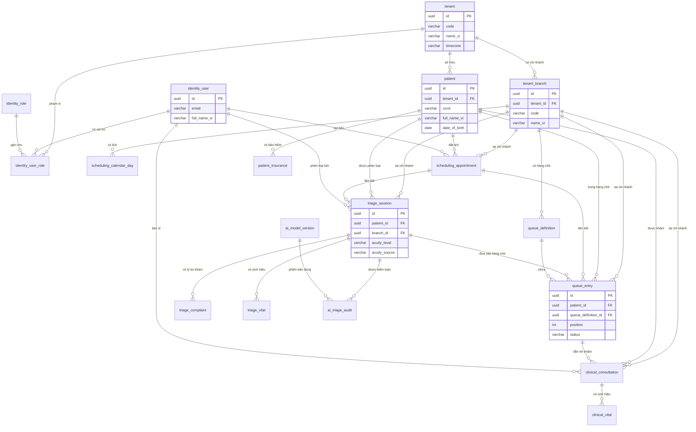

# ERD: Hệ thống Luồng bệnh nhân & Phân loại ưu tiên bằng AI (Phòng khám Việt Nam)

**Cách tiếp cận:** Modular monolith — triển khai một bộ, schema tổ chức theo ngữ cảnh giới hạn (module). Cùng một database, ranh giới module logic để sau này tách module nếu cần.

**Bối cảnh Việt Nam:** CCCD, BHYT, cấu trúc tên tiếng Việt, phân cấp phòng khám/chi nhánh, locale `vi-VN`.

---

## Tổng quan module

| Module | Mục đích | Dùng chung / Ranh giới |
|--------|----------|------------------------|
| **tenant** | Phòng khám, chi nhánh, đa tenant | Gốc; được tham chiếu bởi tất cả |
| **identity** | Người dùng, vai trò, quyền | Phụ thuộc tenant |
| **patient** | Bệnh nhân chính, nhân khẩu học, bảo hiểm | Phụ thuộc tenant |
| **scheduling** | Lịch hẹn, khung giờ, lịch làm việc | Phụ thuộc tenant, patient, identity |
| **triage** | Phiên phân loại, đầu vào/đầu ra AI, mức độ ưu tiên | Phụ thuộc tenant, patient, identity |
| **queue** | Vị trí hàng chờ, thời gian chờ, trạng thái luồng | Phụ thuộc tenant, patient, triage, identity |
| **clinical** | Khám, sinh hiệu, ghi chú (gọn nhẹ) | Phụ thuộc tenant, patient, identity |
| **ai_audit** | Phiên bản model, kiểm toán quyết định AI | Phụ thuộc triage |

---

## 1. Module Tenant (Đơn vị thuê)

**Mục đích:** Gốc đa tenant; một tenant = một phòng khám hoặc một tập đoàn phòng khám (một công ty, nhiều chi nhánh).

| Bảng | Mô tả |
|------|--------|
| `tenant` | Phòng khám hoặc tập đoàn phòng khám (gốc tenant). |
| `tenant_branch` | Địa điểm vật lý (chi nhánh) thuộc tenant. |

### Bảng & Trường chính

**tenant**

| Cột | Kiểu | Ghi chú |
|-----|------|--------|
| `id` | UUID PK | |
| `code` | VARCHAR(32) UNIQUE NOT NULL | VD: `CLINIC_HN_01` |
| `name_vi` | VARCHAR(255) NOT NULL | Tên pháp lý/hiển thị (tiếng Việt) |
| `name_en` | VARCHAR(255) | Tiếng Anh (tùy chọn) |
| `tax_code` | VARCHAR(32) | Mã số thuế (nếu có) |
| `locale` | VARCHAR(10) DEFAULT 'vi-VN' | |
| `timezone` | VARCHAR(50) DEFAULT 'Asia/Ho_Chi_Minh' | |
| `settings_json` | JSONB / JSON | Cờ tính năng, giới hạn, cấu hình |
| `is_active` | BOOLEAN DEFAULT true | |
| `created_at`, `updated_at` | TIMESTAMPTZ | |

**tenant_branch**

| Cột | Kiểu | Ghi chú |
|-----|------|--------|
| `id` | UUID PK | |
| `tenant_id` | UUID FK → tenant(id) NOT NULL | |
| `code` | VARCHAR(32) NOT NULL | Duy nhất trong tenant, VD: `BRANCH_01` |
| `name_vi` | VARCHAR(255) NOT NULL | |
| `address_line` | VARCHAR(500) | Địa chỉ đầy đủ |
| `city` | VARCHAR(100) | Tỉnh/Thành phố |
| `district` | VARCHAR(100) | Quận/Huyện |
| `ward` | VARCHAR(100) | Phường/Xã |
| `phone` | VARCHAR(20) | |
| `is_active` | BOOLEAN DEFAULT true | |
| `created_at`, `updated_at` | TIMESTAMPTZ | |

**Quan hệ:**  
`tenant` 1 — N `tenant_branch` (một tenant, nhiều chi nhánh).

---

## 2. Module Identity (Định danh)

**Mục đích:** Nhân viên và người dùng hệ thống; vai trò và quyền theo tenant.

| Bảng | Mô tả |
|------|--------|
| `identity_user` | Tài khoản người dùng (nhân viên, admin). |
| `identity_role` | Định nghĩa vai trò (VD: Lễ tân, Y tá phân loại, Bác sĩ, Admin). |
| `identity_user_role` | Gán vai trò cho user theo tenant/chi nhánh. |

### Bảng & Trường chính

**identity_user**

| Cột | Kiểu | Ghi chú |
|-----|------|--------|
| `id` | UUID PK | |
| `email` | VARCHAR(255) UNIQUE NOT NULL | Định danh đăng nhập |
| `password_hash` | VARCHAR(255) | Null nếu chỉ SSO |
| `full_name_vi` | VARCHAR(255) NOT NULL | Họ và tên |
| `phone` | VARCHAR(20) | |
| `is_active` | BOOLEAN DEFAULT true | |
| `last_login_at` | TIMESTAMPTZ | |
| `created_at`, `updated_at` | TIMESTAMPTZ | |

**identity_role**

| Cột | Kiểu | Ghi chú |
|-----|------|--------|
| `id` | UUID PK | |
| `code` | VARCHAR(64) UNIQUE NOT NULL | VD: `RECEPTIONIST`, `TRIAGE_NURSE`, `DOCTOR` |
| `name_vi` | VARCHAR(255) NOT NULL | |
| `description` | TEXT | |
| `permissions_json` | JSONB / JSON | Danh sách mã quyền |
| `created_at`, `updated_at` | TIMESTAMPTZ | |

**identity_user_role**

| Cột | Kiểu | Ghi chú |
|-----|------|--------|
| `id` | UUID PK | |
| `user_id` | UUID FK → identity_user(id) NOT NULL | |
| `role_id` | UUID FK → identity_role(id) NOT NULL | |
| `tenant_id` | UUID FK → tenant(id) NOT NULL | Phạm vi: tenant nào |
| `branch_id` | UUID FK → tenant_branch(id) | Null = mọi chi nhánh; có giá trị = một chi nhánh |
| `created_at` | TIMESTAMPTZ | |

**Quan hệ:**  
- `identity_user` N — N `identity_role` qua `identity_user_role`.  
- `identity_user_role` N — 1 `tenant`, N — 1 `tenant_branch` (tùy chọn).

---

## 3. Module Patient (Bệnh nhân)

**Mục đích:** Dữ liệu bệnh nhân chính và nhân khẩu học; BHYT và CCCD cho Việt Nam.

| Bảng | Mô tả |
|------|--------|
| `patient` | Một dòng mỗi bệnh nhân (toàn cục hoặc theo tenant tùy thiết kế). |
| `patient_insurance` | Bảo hiểm y tế (BHYT) và bảo hiểm khác. |

### Bảng & Trường chính

**patient**

| Cột | Kiểu | Ghi chú |
|-----|------|--------|
| `id` | UUID PK | |
| `tenant_id` | UUID FK → tenant(id) NOT NULL | Tenant “sở hữu” bản ghi (nếu bệnh nhân theo tenant) |
| `external_id` | VARCHAR(64) | Mã bệnh nhân riêng của phòng khám |
| `cccd` | VARCHAR(20) | CCCD; đánh index để tra cứu |
| `full_name_vi` | VARCHAR(255) NOT NULL | Họ và tên |
| `date_of_birth` | DATE NOT NULL | |
| `gender` | VARCHAR(20) | VD: MALE, FEMALE, OTHER |
| `phone` | VARCHAR(20) | |
| `email` | VARCHAR(255) | |
| `address_line` | VARCHAR(500) | |
| `city` | VARCHAR(100) | |
| `district` | VARCHAR(100) | |
| `ward` | VARCHAR(100) | |
| `nationality` | VARCHAR(100) DEFAULT 'VN' | |
| `ethnicity` | VARCHAR(100) | Dân tộc (tùy chọn) |
| `is_active` | BOOLEAN DEFAULT true | Xóa mềm |
| `created_at`, `updated_at` | TIMESTAMPTZ | |

**patient_insurance**

| Cột | Kiểu | Ghi chú |
|-----|------|--------|
| `id` | UUID PK | |
| `patient_id` | UUID FK → patient(id) NOT NULL | |
| `insurance_type` | VARCHAR(32) NOT NULL | VD: BHYT, BHQT |
| `insurance_number` | VARCHAR(64) NOT NULL | Số thẻ BHYT |
| `holder_name` | VARCHAR(255) | Người hưởng (nếu khác bệnh nhân) |
| `valid_from` | DATE | |
| `valid_to` | DATE | |
| `is_primary` | BOOLEAN DEFAULT false | Một bảo hiểm chính mỗi bệnh nhân |
| `created_at`, `updated_at` | TIMESTAMPTZ | |

**Quan hệ:**  
- `patient` N — 1 `tenant` (nếu theo tenant).  
- `patient` 1 — N `patient_insurance`.

**Index khuyến nghị:**  
`patient(tenant_id, cccd)`, `patient(tenant_id, external_id)`, `patient_insurance(patient_id, is_primary)`.

---

## 4. Module Scheduling (Đặt lịch)

**Mục đích:** Lịch hẹn và quản lý khung giờ theo chi nhánh.

| Bảng | Mô tả |
|------|--------|
| `scheduling_slot_template` | Mẫu khung giờ dùng lại (VD: 08:00–08:15). |
| `scheduling_calendar_day` | Ghi đè theo ngày theo chi nhánh (nghỉ, giờ đặc biệt). |
| `scheduling_appointment` | Lịch hẹn đã đặt. |

### Bảng & Trường chính

**scheduling_slot_template**

| Cột | Kiểu | Ghi chú |
|-----|------|--------|
| `id` | UUID PK | |
| `tenant_id` | UUID FK → tenant(id) NOT NULL | |
| `code` | VARCHAR(64) NOT NULL | VD: `MORNING_15` |
| `start_time` | TIME NOT NULL | Giờ địa phương |
| `duration_minutes` | SMALLINT NOT NULL | |
| `is_active` | BOOLEAN DEFAULT true | |
| `created_at`, `updated_at` | TIMESTAMPTZ | |

**scheduling_calendar_day**

| Cột | Kiểu | Ghi chú |
|-----|------|--------|
| `id` | UUID PK | |
| `branch_id` | UUID FK → tenant_branch(id) NOT NULL | |
| `date` | DATE NOT NULL | |
| `day_type` | VARCHAR(32) NOT NULL | VD: OPEN, CLOSED, REDUCED |
| `open_at` | TIME | Null nếu CLOSED |
| `close_at` | TIME | |
| `notes` | VARCHAR(500) | |
| `created_at`, `updated_at` | TIMESTAMPTZ | |

**scheduling_appointment**

| Cột | Kiểu | Ghi chú |
|-----|------|--------|
| `id` | UUID PK | |
| `tenant_id` | UUID FK → tenant(id) NOT NULL | |
| `branch_id` | UUID FK → tenant_branch(id) NOT NULL | |
| `patient_id` | UUID FK → patient(id) NOT NULL | |
| `appointment_date` | DATE NOT NULL | |
| `slot_start_time` | TIME NOT NULL | |
| `slot_end_time` | TIME | |
| `status` | VARCHAR(32) NOT NULL | VD: SCHEDULED, CHECKED_IN, CANCELLED, NO_SHOW, COMPLETED |
| `appointment_type` | VARCHAR(32) | VD: FIRST_VISIT, FOLLOW_UP, VACCINE |
| `notes` | TEXT | |
| `created_by_user_id` | UUID FK → identity_user(id) | |
| `created_at`, `updated_at` | TIMESTAMPTZ | |

**Quan hệ:**  
- `scheduling_slot_template` N — 1 `tenant`.  
- `scheduling_calendar_day` N — 1 `tenant_branch`; unique `(branch_id, date)`.  
- `scheduling_appointment` N — 1 `tenant`, N — 1 `tenant_branch`, N — 1 `patient`, N — 1 `identity_user` (người tạo).

---

## 5. Module Triage (Phân loại ưu tiên)

**Mục đích:** Lý do đến khám, sinh hiệu, gợi ý AI và mức độ ưu tiên (lõi phân loại bằng AI).

| Bảng | Mô tả |
|------|--------|
| `triage_session` | Một phiên phân loại mỗi lần đến khám. |
| `triage_complaint` | Lý do đến khám / triệu chứng (có thể nhiều). |
| `triage_vital` | Sinh hiệu lúc phân loại (tùy chọn nhưng thường dùng). |

### Bảng & Trường chính

**triage_session**

| Cột | Kiểu | Ghi chú |
|-----|------|--------|
| `id` | UUID PK | |
| `tenant_id` | UUID FK → tenant(id) NOT NULL | |
| `branch_id` | UUID FK → tenant_branch(id) NOT NULL | |
| `patient_id` | UUID FK → patient(id) NOT NULL | |
| `appointment_id` | UUID FK → scheduling_appointment(id) | Null nếu walk-in |
| `triaged_by_user_id` | UUID FK → identity_user(id) | Y tá/nhân viên thực hiện phân loại |
| `started_at` | TIMESTAMPTZ NOT NULL | |
| `ended_at` | TIMESTAMPTZ | |
| `acuity_level` | VARCHAR(32) NOT NULL | VD: 1–5 hoặc RESUSCITATION, EMERGENT, URGENT, LESS_URGENT, NON_URGENT |
| `acuity_source` | VARCHAR(32) | HUMAN, AI, HYBRID |
| `ai_suggested_acuity` | VARCHAR(32) | Gợi ý AI gốc trước khi ghi đè |
| `ai_confidence_score` | DECIMAL(5,4) | 0–1 nếu model cung cấp |
| `chief_complaint_text` | TEXT | Tóm tắt tự do |
| `notes` | TEXT | |
| `created_at`, `updated_at` | TIMESTAMPTZ | |

**triage_complaint**

| Cột | Kiểu | Ghi chú |
|-----|------|--------|
| `id` | UUID PK | |
| `triage_session_id` | UUID FK → triage_session(id) NOT NULL | |
| `complaint_type` | VARCHAR(64) | VD: mã triệu chứng hoặc từ khóa |
| `complaint_text` | VARCHAR(500) NOT NULL | |
| `display_order` | SMALLINT DEFAULT 0 | |
| `created_at` | TIMESTAMPTZ | |

**triage_vital**

| Cột | Kiểu | Ghi chú |
|-----|------|--------|
| `id` | UUID PK | |
| `triage_session_id` | UUID FK → triage_session(id) NOT NULL | |
| `vital_type` | VARCHAR(32) NOT NULL | VD: HEART_RATE, BP_SYSTOLIC, BP_DIASTOLIC, TEMPERATURE, SPO2, RESPIRATORY_RATE, WEIGHT, HEIGHT |
| `value_numeric` | DECIMAL(10,2) | |
| `unit` | VARCHAR(20) | VD: bpm, mmHg, °C, % |
| `recorded_at` | TIMESTAMPTZ NOT NULL | |
| `created_at` | TIMESTAMPTZ | |

**Quan hệ:**  
- `triage_session` N — 1 `tenant`, N — 1 `tenant_branch`, N — 1 `patient`, N — 1 `scheduling_appointment`, N — 1 `identity_user`.  
- `triage_session` 1 — N `triage_complaint`, 1 — N `triage_vital`.

---

## 6. Module Queue (Hàng chờ)

**Mục đích:** Vị trí trong hàng chờ, thời gian chờ, trạng thái luồng (sau phân loại).

| Bảng | Mô tả |
|------|--------|
| `queue_definition` | Hàng chờ đặt tên theo chi nhánh (VD: Khám tổng quát, Cấp cứu). |
| `queue_entry` | Vị trí hiện tại của bệnh nhân trong hàng chờ (một bản ghi đang hoạt động mỗi bệnh nhân mỗi chi nhánh mỗi ngày). |

### Bảng & Trường chính

**queue_definition**

| Cột | Kiểu | Ghi chú |
|-----|------|--------|
| `id` | UUID PK | |
| `branch_id` | UUID FK → tenant_branch(id) NOT NULL | |
| `code` | VARCHAR(64) NOT NULL | Duy nhất theo chi nhánh |
| `name_vi` | VARCHAR(255) NOT NULL | |
| `acuity_filter` | VARCHAR(255) | Tùy chọn: mức acuity nào dùng hàng chờ này (mảng JSON hoặc danh sách) |
| `display_order` | SMALLINT DEFAULT 0 | |
| `is_active` | BOOLEAN DEFAULT true | |
| `created_at`, `updated_at` | TIMESTAMPTZ | |

**queue_entry**

| Cột | Kiểu | Ghi chú |
|-----|------|--------|
| `id` | UUID PK | |
| `tenant_id` | UUID FK → tenant(id) NOT NULL | |
| `branch_id` | UUID FK → tenant_branch(id) NOT NULL | |
| `queue_definition_id` | UUID FK → queue_definition(id) NOT NULL | |
| `patient_id` | UUID FK → patient(id) NOT NULL | |
| `triage_session_id` | UUID FK → triage_session(id) | Liên kết phiên phân loại đưa vào hàng chờ |
| `appointment_id` | UUID FK → scheduling_appointment(id) | Tùy chọn |
| `position` | INT NOT NULL | Thứ tự 1-based trong hàng chờ |
| `status` | VARCHAR(32) NOT NULL | VD: WAITING, CALLED, IN_CONSULTATION, COMPLETED, CANCELLED, NO_SHOW |
| `joined_at` | TIMESTAMPTZ NOT NULL | |
| `called_at` | TIMESTAMPTZ | Khi gọi bệnh nhân vào phòng |
| `completed_at` | TIMESTAMPTZ | |
| `created_at`, `updated_at` | TIMESTAMPTZ | |

**Quan hệ:**  
- `queue_definition` N — 1 `tenant_branch`.  
- `queue_entry` N — 1 `tenant`, N — 1 `tenant_branch`, N — 1 `queue_definition`, N — 1 `patient`, N — 1 `triage_session`, N — 1 `scheduling_appointment`.

**Tính toán:** Thời gian chờ = `called_at - joined_at` (hoặc now − `joined_at` nếu vẫn đang chờ). Một bản ghi đang hoạt động duy nhất cho (patient, branch, date) — ép trong app hoặc unique partial index.

---

## 7. Module Clinical (Khám bệnh – gọn nhẹ)

**Mục đích:** Khám và sinh hiệu tối thiểu cho luồng sau hàng chờ (EMR đầy đủ có thể tách sau).

| Bảng | Mô tả |
|------|--------|
| `clinical_consultation` | Một lần khám mỗi “phòng”. |
| `clinical_vital` | Sinh hiệu trong khám (tùy chọn; sinh hiệu lúc phân loại có thể đủ). |

### Bảng & Trường chính

**clinical_consultation**

| Cột | Kiểu | Ghi chú |
|-----|------|--------|
| `id` | UUID PK | |
| `tenant_id` | UUID FK → tenant(id) NOT NULL | |
| `branch_id` | UUID FK → tenant_branch(id) NOT NULL | |
| `patient_id` | UUID FK → patient(id) NOT NULL | |
| `queue_entry_id` | UUID FK → queue_entry(id) | Liên kết ngược hàng chờ |
| `doctor_user_id` | UUID FK → identity_user(id) | |
| `room_or_station` | VARCHAR(64) | Phòng khám |
| `started_at` | TIMESTAMPTZ NOT NULL | |
| `ended_at` | TIMESTAMPTZ | |
| `status` | VARCHAR(32) NOT NULL | VD: IN_PROGRESS, COMPLETED, CANCELLED |
| `chief_complaint_summary` | TEXT | Sao chép hoặc tóm tắt từ phân loại |
| `diagnosis_notes` | TEXT | Văn bản tự do hoặc mã (đơn giản) |
| `prescription_notes` | TEXT | Hoặc liên kết module kê đơn sau |
| `created_at`, `updated_at` | TIMESTAMPTZ | |

**clinical_vital** (tùy chọn)

| Cột | Kiểu | Ghi chú |
|-----|------|--------|
| `id` | UUID PK | |
| `consultation_id` | UUID FK → clinical_consultation(id) NOT NULL | |
| `vital_type` | VARCHAR(32) NOT NULL | Giống triage_vital |
| `value_numeric` | DECIMAL(10,2) | |
| `unit` | VARCHAR(20) | |
| `recorded_at` | TIMESTAMPTZ NOT NULL | |
| `created_at` | TIMESTAMPTZ | |

**Quan hệ:**  
- `clinical_consultation` N — 1 `tenant`, N — 1 `tenant_branch`, N — 1 `patient`, N — 1 `queue_entry`, N — 1 `identity_user`.  
- `clinical_vital` N — 1 `clinical_consultation`.

---

## 8. Module AI Audit (Kiểm toán AI)

**Mục đích:** Truy vết phân loại bằng AI (phiên bản model, đầu vào, đầu ra) cho an toàn và tuân thủ.

| Bảng | Mô tả |
|------|--------|
| `ai_model_version` | Phiên bản model triển khai và cấu hình. |
| `ai_triage_audit` | Một dòng mỗi lần gọi AI (ảnh đầu vào, đầu ra, độ trễ). |

### Bảng & Trường chính

**ai_model_version**

| Cột | Kiểu | Ghi chú |
|-----|------|--------|
| `id` | UUID PK | |
| `model_key` | VARCHAR(64) NOT NULL | VD: triage_acuity_v1 |
| `version` | VARCHAR(32) NOT NULL | VD: 1.2.0 |
| `config_json` | JSONB / JSON | Prompt, tham số, ngưỡng |
| `deployed_at` | TIMESTAMPTZ NOT NULL | |
| `deprecated_at` | TIMESTAMPTZ | Null = đang dùng |
| `created_at` | TIMESTAMPTZ | |

**ai_triage_audit**

| Cột | Kiểu | Ghi chú |
|-----|------|--------|
| `id` | UUID PK | |
| `triage_session_id` | UUID FK → triage_session(id) NOT NULL | |
| `model_version_id` | UUID FK → ai_model_version(id) NOT NULL | |
| `input_json` | JSONB / JSON | Lý do khám, sinh hiệu, tuổi, v.v. (ẩn danh nếu cần) |
| `output_json` | JSONB / JSON | Acuity gợi ý, độ tin cậy, giải thích |
| `latency_ms` | INT | Độ trễ round-trip (ms) |
| `called_at` | TIMESTAMPTZ NOT NULL | |
| `created_at` | TIMESTAMPTZ | |

**Quan hệ:**  
- `ai_triage_audit` N — 1 `triage_session`, N — 1 `ai_model_version`.

---

## Tóm tắt quan hệ liên module

```
tenant
  ├── tenant_branch (1:N)
  ├── identity_user_role (N:1) [qua tenant_id]
  ├── patient (N:1)
  ├── scheduling_* (N:1)
  ├── triage_session (N:1)
  ├── queue_entry (N:1)
  └── clinical_consultation (N:1)

tenant_branch
  ├── scheduling_calendar_day (1:N)
  ├── scheduling_appointment (N:1)
  ├── queue_definition (1:N)
  ├── triage_session (N:1)
  ├── queue_entry (N:1)
  └── clinical_consultation (N:1)

patient
  ├── patient_insurance (1:N)
  ├── scheduling_appointment (1:N)
  ├── triage_session (1:N)
  ├── queue_entry (1:N)
  └── clinical_consultation (1:N)

identity_user
  ├── identity_user_role (1:N)
  ├── scheduling_appointment (N:1 created_by)
  ├── triage_session (N:1 triaged_by)
  └── clinical_consultation (N:1 doctor)

triage_session
  ├── triage_complaint (1:N)
  ├── triage_vital (1:N)
  ├── queue_entry (1:N)
  ├── ai_triage_audit (1:N)
  └── clinical_consultation (gián tiếp qua queue_entry)

scheduling_appointment
  ├── triage_session (1:N)
  └── queue_entry (1:N)

queue_entry
  └── clinical_consultation (1:N)
```

---

## Ghi chú triển khai (Modular Monolith)

1. **Đặt tên schema:** Dùng tiền tố theo module (`tenant_`, `identity_`, `patient_`, `scheduling_`, `triage_`, `queue_`, `clinical_`, `ai_`) để code và migration map 1:1 với module.
2. **Khóa ngoại:** Giữ FK; đảm bảo toàn vẹn và phù hợp một DB. Nếu sau này tách module, cùng schema có thể sang DB khác và FK thay bằng event/ID.
3. **Cách ly tenant:** Mọi bảng theo tenant có `tenant_id`; ép lọc theo dòng trong app (hoặc RLS) để không đọc/ghi chéo tenant.
4. **Việt Nam:** Dùng `name_vi`, CCCD, BHYT; mặc định locale/timezone; địa chỉ (city/district/ward) như trong `tenant_branch` và `patient`.
5. **Idempotency:** Với đăng ký và phân loại, cân nhắc `idempotency_key` (VD trên `scheduling_appointment`, `triage_session`) nếu client có thể gửi lại.
6. **Index:** Ngoài PK và FK, index: `(tenant_id, branch_id, date)` cho lịch hẹn và hàng chờ; `(patient_id, started_at)` cho triage; `(triage_session_id)` cho audit; `cccd`, `external_id` như trên.

Tài liệu ERD này mô tả một mô hình thống nhất cho hệ thống luồng bệnh nhân và phân loại ưu tiên bằng AI tại Việt Nam, với các module và quan hệ rõ ràng phù hợp kiến trúc modular monolith (VD Java Spring Boot, một schema, package theo module).

---

## Sơ đồ ERD Mermaid (Mức cao)


