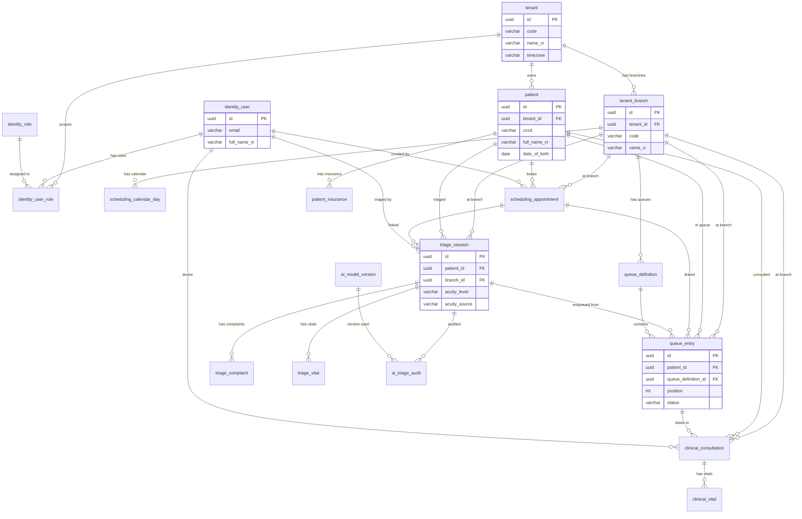

# ERD: AI-Powered Patient Flow & Triage System (Vietnam Clinics)

**Approach:** Modular monolith — single deployment, schema organized by bounded contexts (modules). Same database, logical module boundaries for future extraction if needed.

**Vietnam context:** CCCD (Citizen ID), BHYT (health insurance), Vietnamese name structure, clinic/branch hierarchy, locale `vi-VN`.

---

## Module Overview

| Module | Purpose | Shared / Boundary |
|--------|---------|-------------------|
| **tenant** | Clinics, branches, multi-tenancy | Root; referenced by all |
| **identity** | Users, roles, permissions | Depends on tenant |
| **patient** | Patient master, demographics, insurance | Depends on tenant |
| **scheduling** | Appointments, slots, calendars | Depends on tenant, patient, identity |
| **triage** | Triage sessions, AI inputs/outputs, acuity | Depends on tenant, patient, identity |
| **queue** | Queue positions, wait times, flow state | Depends on tenant, patient, triage, identity |
| **clinical** | Consultations, vitals, notes (lightweight) | Depends on tenant, patient, identity |
| **ai_audit** | Model versions, AI decision audit | Depends on triage |

---

## 1. Tenant Module

**Purpose:** Multi-tenant root; one tenant = one clinic or clinic group (e.g. one company, many branches).

| Table | Description |
|-------|-------------|
| `tenant` | Clinic or clinic group (tenant root). |
| `tenant_branch` | Physical locations (branches) under a tenant. |

### Tables & Key Fields

**tenant**

| Column | Type | Notes |
|--------|------|--------|
| `id` | UUID PK | |
| `code` | VARCHAR(32) UNIQUE NOT NULL | e.g. `CLINIC_HN_01` |
| `name_vi` | VARCHAR(255) NOT NULL | Legal/display name (Vietnamese) |
| `name_en` | VARCHAR(255) | Optional English |
| `tax_code` | VARCHAR(32) | Mã số thuế (if applicable) |
| `locale` | VARCHAR(10) DEFAULT 'vi-VN' | |
| `timezone` | VARCHAR(50) DEFAULT 'Asia/Ho_Chi_Minh' | |
| `settings_json` | JSONB / JSON | Feature flags, limits, config |
| `is_active` | BOOLEAN DEFAULT true | |
| `created_at`, `updated_at` | TIMESTAMPTZ | |

**tenant_branch**

| Column | Type | Notes |
|--------|------|--------|
| `id` | UUID PK | |
| `tenant_id` | UUID FK → tenant(id) NOT NULL | |
| `code` | VARCHAR(32) NOT NULL | Unique within tenant, e.g. `BRANCH_01` |
| `name_vi` | VARCHAR(255) NOT NULL | |
| `address_line` | VARCHAR(500) | Full address |
| `city` | VARCHAR(100) | Tỉnh/Thành phố |
| `district` | VARCHAR(100) | Quận/Huyện |
| `ward` | VARCHAR(100) | Phường/Xã |
| `phone` | VARCHAR(20) | |
| `is_active` | BOOLEAN DEFAULT true | |
| `created_at`, `updated_at` | TIMESTAMPTZ | |

**Relationships:**  
`tenant` 1 — N `tenant_branch` (one tenant, many branches).

---

## 2. Identity Module

**Purpose:** Staff and system users; roles and permissions scoped by tenant.

| Table | Description |
|-------|-------------|
| `identity_user` | User accounts (staff, admins). |
| `identity_role` | Role definitions (e.g. Receptionist, Nurse, Doctor, Admin). |
| `identity_user_role` | User–role assignment per tenant/branch. |

### Tables & Key Fields

**identity_user**

| Column | Type | Notes |
|--------|------|--------|
| `id` | UUID PK | |
| `email` | VARCHAR(255) UNIQUE NOT NULL | Login identifier |
| `password_hash` | VARCHAR(255) | Null if SSO-only |
| `full_name_vi` | VARCHAR(255) NOT NULL | Họ và tên |
| `phone` | VARCHAR(20) | |
| `is_active` | BOOLEAN DEFAULT true | |
| `last_login_at` | TIMESTAMPTZ | |
| `created_at`, `updated_at` | TIMESTAMPTZ | |

**identity_role**

| Column | Type | Notes |
|--------|------|--------|
| `id` | UUID PK | |
| `code` | VARCHAR(64) UNIQUE NOT NULL | e.g. `RECEPTIONIST`, `TRIAGE_NURSE`, `DOCTOR` |
| `name_vi` | VARCHAR(255) NOT NULL | |
| `description` | TEXT | |
| `permissions_json` | JSONB / JSON | List of permission codes |
| `created_at`, `updated_at` | TIMESTAMPTZ | |

**identity_user_role**

| Column | Type | Notes |
|--------|------|--------|
| `id` | UUID PK | |
| `user_id` | UUID FK → identity_user(id) NOT NULL | |
| `role_id` | UUID FK → identity_role(id) NOT NULL | |
| `tenant_id` | UUID FK → tenant(id) NOT NULL | Scope: which tenant |
| `branch_id` | UUID FK → tenant_branch(id) | Null = all branches; set = single branch |
| `created_at` | TIMESTAMPTZ | |

**Relationships:**  
- `identity_user` N — N `identity_role` via `identity_user_role`.  
- `identity_user_role` N — 1 `tenant`, N — 1 `tenant_branch` (optional).

---

## 3. Patient Module

**Purpose:** Patient master data and demographics; BHYT and CCCD for Vietnam.

| Table | Description |
|-------|-------------|
| `patient` | One row per patient (global or per-tenant by design choice). |
| `patient_insurance` | Health insurance (BHYT) and other insurance. |

### Tables & Key Fields

**patient**

| Column | Type | Notes |
|--------|------|--------|
| `id` | UUID PK | |
| `tenant_id` | UUID FK → tenant(id) NOT NULL | Tenant that “owns” this record (if tenant-scoped patients) |
| `external_id` | VARCHAR(64) | Clinic’s own Mã bệnh nhân |
| `cccd` | VARCHAR(20) | Citizen ID (CCCD); index for lookup |
| `full_name_vi` | VARCHAR(255) NOT NULL | Họ và tên |
| `date_of_birth` | DATE NOT NULL | |
| `gender` | VARCHAR(20) | e.g. MALE, FEMALE, OTHER |
| `phone` | VARCHAR(20) | |
| `email` | VARCHAR(255) | |
| `address_line` | VARCHAR(500) | |
| `city` | VARCHAR(100) | |
| `district` | VARCHAR(100) | |
| `ward` | VARCHAR(100) | |
| `nationality` | VARCHAR(100) DEFAULT 'VN' | |
| `ethnicity` | VARCHAR(100) | Optional (dân tộc) |
| `is_active` | BOOLEAN DEFAULT true | Soft delete |
| `created_at`, `updated_at` | TIMESTAMPTZ | |

**patient_insurance**

| Column | Type | Notes |
|--------|------|--------|
| `id` | UUID PK | |
| `patient_id` | UUID FK → patient(id) NOT NULL | |
| `insurance_type` | VARCHAR(32) NOT NULL | e.g. BHYT, BHQT |
| `insurance_number` | VARCHAR(64) NOT NULL | Số thẻ BHYT |
| `holder_name` | VARCHAR(255) | Người hưởng (if different from patient) |
| `valid_from` | DATE | |
| `valid_to` | DATE | |
| `is_primary` | BOOLEAN DEFAULT false | One primary per patient |
| `created_at`, `updated_at` | TIMESTAMPTZ | |

**Relationships:**  
- `patient` N — 1 `tenant` (if tenant-scoped).  
- `patient` 1 — N `patient_insurance`.

**Indexes (recommended):**  
`patient(tenant_id, cccd)`, `patient(tenant_id, external_id)`, `patient_insurance(patient_id, is_primary)`.

---

## 4. Scheduling Module

**Purpose:** Appointments and slot management per branch.

| Table | Description |
|-------|-------------|
| `scheduling_slot_template` | Reusable slot templates (e.g. 08:00–08:15). |
| `scheduling_calendar_day` | Per-branch overrides (closed, special hours). |
| `scheduling_appointment` | Booked appointments. |

### Tables & Key Fields

**scheduling_slot_template**

| Column | Type | Notes |
|--------|------|--------|
| `id` | UUID PK | |
| `tenant_id` | UUID FK → tenant(id) NOT NULL | |
| `code` | VARCHAR(64) NOT NULL | e.g. `MORNING_15` |
| `start_time` | TIME NOT NULL | Local time |
| `duration_minutes` | SMALLINT NOT NULL | |
| `is_active` | BOOLEAN DEFAULT true | |
| `created_at`, `updated_at` | TIMESTAMPTZ | |

**scheduling_calendar_day**

| Column | Type | Notes |
|--------|------|--------|
| `id` | UUID PK | |
| `branch_id` | UUID FK → tenant_branch(id) NOT NULL | |
| `date` | DATE NOT NULL | |
| `day_type` | VARCHAR(32) NOT NULL | e.g. OPEN, CLOSED, REDUCED |
| `open_at` | TIME | Null if CLOSED |
| `close_at` | TIME | |
| `notes` | VARCHAR(500) | |
| `created_at`, `updated_at` | TIMESTAMPTZ | |

**scheduling_appointment**

| Column | Type | Notes |
|--------|------|--------|
| `id` | UUID PK | |
| `tenant_id` | UUID FK → tenant(id) NOT NULL | |
| `branch_id` | UUID FK → tenant_branch(id) NOT NULL | |
| `patient_id` | UUID FK → patient(id) NOT NULL | |
| `appointment_date` | DATE NOT NULL | |
| `slot_start_time` | TIME NOT NULL | |
| `slot_end_time` | TIME | |
| `status` | VARCHAR(32) NOT NULL | e.g. SCHEDULED, CHECKED_IN, CANCELLED, NO_SHOW, COMPLETED |
| `appointment_type` | VARCHAR(32) | e.g. FIRST_VISIT, FOLLOW_UP, VACCINE |
| `notes` | TEXT | |
| `created_by_user_id` | UUID FK → identity_user(id) | |
| `created_at`, `updated_at` | TIMESTAMPTZ | |

**Relationships:**  
- `scheduling_slot_template` N — 1 `tenant`.  
- `scheduling_calendar_day` N — 1 `tenant_branch`; unique `(branch_id, date)`.  
- `scheduling_appointment` N — 1 `tenant`, N — 1 `tenant_branch`, N — 1 `patient`, N — 1 `identity_user` (creator).

---

## 5. Triage Module

**Purpose:** Chief complaint, vitals, AI suggestion, and acuity (core of AI triage).

| Table | Description |
|-------|-------------|
| `triage_session` | One triage encounter per visit. |
| `triage_complaint` | Chief complaint / symptom (can be multiple). |
| `triage_vital` | Vital signs at triage (optional but common). |

### Tables & Key Fields

**triage_session**

| Column | Type | Notes |
|--------|------|--------|
| `id` | UUID PK | |
| `tenant_id` | UUID FK → tenant(id) NOT NULL | |
| `branch_id` | UUID FK → tenant_branch(id) NOT NULL | |
| `patient_id` | UUID FK → patient(id) NOT NULL | |
| `appointment_id` | UUID FK → scheduling_appointment(id) | Null if walk-in |
| `triaged_by_user_id` | UUID FK → identity_user(id) | Nurse/staff who performed triage |
| `started_at` | TIMESTAMPTZ NOT NULL | |
| `ended_at` | TIMESTAMPTZ | |
| `acuity_level` | VARCHAR(32) NOT NULL | e.g. 1–5 or RESUSCITATION, EMERGENT, URGENT, LESS_URGENT, NON_URGENT |
| `acuity_source` | VARCHAR(32) | HUMAN, AI, HYBRID |
| `ai_suggested_acuity` | VARCHAR(32) | Raw AI suggestion before override |
| `ai_confidence_score` | DECIMAL(5,4) | 0–1 if provided by model |
| `chief_complaint_text` | TEXT | Free text summary |
| `notes` | TEXT | |
| `created_at`, `updated_at` | TIMESTAMPTZ | |

**triage_complaint**

| Column | Type | Notes |
|--------|------|--------|
| `id` | UUID PK | |
| `triage_session_id` | UUID FK → triage_session(id) NOT NULL | |
| `complaint_type` | VARCHAR(64) | e.g. symptom code or keyword |
| `complaint_text` | VARCHAR(500) NOT NULL | |
| `display_order` | SMALLINT DEFAULT 0 | |
| `created_at` | TIMESTAMPTZ | |

**triage_vital**

| Column | Type | Notes |
|--------|------|--------|
| `id` | UUID PK | |
| `triage_session_id` | UUID FK → triage_session(id) NOT NULL | |
| `vital_type` | VARCHAR(32) NOT NULL | e.g. HEART_RATE, BP_SYSTOLIC, BP_DIASTOLIC, TEMPERATURE, SPO2, RESPIRATORY_RATE, WEIGHT, HEIGHT |
| `value_numeric` | DECIMAL(10,2) | |
| `unit` | VARCHAR(20) | e.g. bpm, mmHg, °C, % |
| `recorded_at` | TIMESTAMPTZ NOT NULL | |
| `created_at` | TIMESTAMPTZ | |

**Relationships:**  
- `triage_session` N — 1 `tenant`, N — 1 `tenant_branch`, N — 1 `patient`, N — 1 `scheduling_appointment`, N — 1 `identity_user`.  
- `triage_session` 1 — N `triage_complaint`, 1 — N `triage_vital`.

---

## 6. Queue Module

**Purpose:** Current queue position, wait times, and flow state (post-triage).

| Table | Description |
|-------|-------------|
| `queue_definition` | Named queues per branch (e.g. “Khám tổng quát”, “Cấp cứu”). |
| `queue_entry` | A patient’s current place in a queue (one active per patient per branch per day). |

### Tables & Key Fields

**queue_definition**

| Column | Type | Notes |
|--------|------|--------|
| `id` | UUID PK | |
| `branch_id` | UUID FK → tenant_branch(id) NOT NULL | |
| `code` | VARCHAR(64) NOT NULL | Unique per branch |
| `name_vi` | VARCHAR(255) NOT NULL | |
| `acuity_filter` | VARCHAR(255) | Optional: which acuity levels use this queue (JSON array or comma list) |
| `display_order` | SMALLINT DEFAULT 0 | |
| `is_active` | BOOLEAN DEFAULT true | |
| `created_at`, `updated_at` | TIMESTAMPTZ | |

**queue_entry**

| Column | Type | Notes |
|--------|------|--------|
| `id` | UUID PK | |
| `tenant_id` | UUID FK → tenant(id) NOT NULL | |
| `branch_id` | UUID FK → tenant_branch(id) NOT NULL | |
| `queue_definition_id` | UUID FK → queue_definition(id) NOT NULL | |
| `patient_id` | UUID FK → patient(id) NOT NULL | |
| `triage_session_id` | UUID FK → triage_session(id) | Link to triage that put them in queue |
| `appointment_id` | UUID FK → scheduling_appointment(id) | Optional |
| `position` | INT NOT NULL | 1-based order in queue |
| `status` | VARCHAR(32) NOT NULL | e.g. WAITING, CALLED, IN_CONSULTATION, COMPLETED, CANCELLED, NO_SHOW |
| `joined_at` | TIMESTAMPTZ NOT NULL | |
| `called_at` | TIMESTAMPTZ | When patient was called to room |
| `completed_at` | TIMESTAMPTZ | |
| `created_at`, `updated_at` | TIMESTAMPTZ | |

**Relationships:**  
- `queue_definition` N — 1 `tenant_branch`.  
- `queue_entry` N — 1 `tenant`, N — 1 `tenant_branch`, N — 1 `queue_definition`, N — 1 `patient`, N — 1 `triage_session`, N — 1 `scheduling_appointment`.

**Derived:** Wait time = `called_at - joined_at` (or now − `joined_at` if still waiting). Unique active entry per (patient, branch, date) enforced in app or unique partial index.

---

## 7. Clinical Module (Lightweight)

**Purpose:** Minimal consultation and vitals for post-queue flow (full EMR can be separate later).

| Table | Description |
|-------|-------------|
| `clinical_consultation` | One consultation per “room” encounter. |
| `clinical_vital` | Vitals in consultation (optional; triage vitals may be enough). |

### Tables & Key Fields

**clinical_consultation**

| Column | Type | Notes |
|--------|------|--------|
| `id` | UUID PK | |
| `tenant_id` | UUID FK → tenant(id) NOT NULL | |
| `branch_id` | UUID FK → tenant_branch(id) NOT NULL | |
| `patient_id` | UUID FK → patient(id) NOT NULL | |
| `queue_entry_id` | UUID FK → queue_entry(id) | Link back to queue |
| `doctor_user_id` | UUID FK → identity_user(id) | |
| `room_or_station` | VARCHAR(64) | Phòng khám |
| `started_at` | TIMESTAMPTZ NOT NULL | |
| `ended_at` | TIMESTAMPTZ | |
| `status` | VARCHAR(32) NOT NULL | e.g. IN_PROGRESS, COMPLETED, CANCELLED |
| `chief_complaint_summary` | TEXT | Copy or summary from triage |
| `diagnosis_notes` | TEXT | Free text or codes (simple) |
| `prescription_notes` | TEXT | Or link to future prescription module |
| `created_at`, `updated_at` | TIMESTAMPTZ | |

**clinical_vital** (optional)

| Column | Type | Notes |
|--------|------|--------|
| `id` | UUID PK | |
| `consultation_id` | UUID FK → clinical_consultation(id) NOT NULL | |
| `vital_type` | VARCHAR(32) NOT NULL | Same as triage_vital |
| `value_numeric` | DECIMAL(10,2) | |
| `unit` | VARCHAR(20) | |
| `recorded_at` | TIMESTAMPTZ NOT NULL | |
| `created_at` | TIMESTAMPTZ | |

**Relationships:**  
- `clinical_consultation` N — 1 `tenant`, N — 1 `tenant_branch`, N — 1 `patient`, N — 1 `queue_entry`, N — 1 `identity_user`.  
- `clinical_vital` N — 1 `clinical_consultation`.

---

## 8. AI Audit Module

**Purpose:** Traceability of AI triage (model version, input, output) for safety and compliance.

| Table | Description |
|-------|-------------|
| `ai_model_version` | Deployed model version and config. |
| `ai_triage_audit` | One row per AI call (input snapshot, output, latency). |

### Tables & Key Fields

**ai_model_version**

| Column | Type | Notes |
|--------|------|--------|
| `id` | UUID PK | |
| `model_key` | VARCHAR(64) NOT NULL | e.g. triage_acuity_v1 |
| `version` | VARCHAR(32) NOT NULL | e.g. 1.2.0 |
| `config_json` | JSONB / JSON | Prompt, params, thresholds |
| `deployed_at` | TIMESTAMPTZ NOT NULL | |
| `deprecated_at` | TIMESTAMPTZ | Null = current |
| `created_at` | TIMESTAMPTZ | |

**ai_triage_audit**

| Column | Type | Notes |
|--------|------|--------|
| `id` | UUID PK | |
| `triage_session_id` | UUID FK → triage_session(id) NOT NULL | |
| `model_version_id` | UUID FK → ai_model_version(id) NOT NULL | |
| `input_json` | JSONB / JSON | Chief complaint, vitals, age, etc. (anonymized if needed) |
| `output_json` | JSONB / JSON | Suggested acuity, confidence, explanation |
| `latency_ms` | INT | Round-trip ms |
| `called_at` | TIMESTAMPTZ NOT NULL | |
| `created_at` | TIMESTAMPTZ | |

**Relationships:**  
- `ai_triage_audit` N — 1 `triage_session`, N — 1 `ai_model_version`.

---

## Cross-Module Relationship Summary

```
tenant
  ├── tenant_branch (1:N)
  ├── identity_user_role (N:1) [via tenant_id]
  ├── patient (N:1)
  ├── scheduling_* (N:1)
  ├── triage_session (N:1)
  ├── queue_entry (N:1)
  └── clinical_consultation (N:1)

tenant_branch
  ├── scheduling_calendar_day (1:N)
  ├── scheduling_appointment (N:1)
  ├── queue_definition (1:N)
  ├── triage_session (N:1)
  ├── queue_entry (N:1)
  └── clinical_consultation (N:1)

patient
  ├── patient_insurance (1:N)
  ├── scheduling_appointment (1:N)
  ├── triage_session (1:N)
  ├── queue_entry (1:N)
  └── clinical_consultation (1:N)

identity_user
  ├── identity_user_role (1:N)
  ├── scheduling_appointment (N:1 created_by)
  ├── triage_session (N:1 triaged_by)
  └── clinical_consultation (N:1 doctor)

triage_session
  ├── triage_complaint (1:N)
  ├── triage_vital (1:N)
  ├── queue_entry (1:N)
  ├── ai_triage_audit (1:N)
  └── clinical_consultation (indirect via queue_entry)

scheduling_appointment
  ├── triage_session (1:N)
  └── queue_entry (1:N)

queue_entry
  └── clinical_consultation (1:N)
```

---

## Implementation Notes (Modular Monolith)

1. **Schema naming:** Use prefix per module (`tenant_`, `identity_`, `patient_`, `scheduling_`, `triage_`, `queue_`, `clinical_`, `ai_`) so code and migrations map 1:1 to modules.
2. **Foreign keys:** Keep FKs; they enforce integrity and match a single DB. If a module is later extracted, the same schema can live in a separate DB and FKs replaced by events/IDs.
3. **Tenant isolation:** All tenant-scoped tables carry `tenant_id`; enforce row-level filtering in app (or RLS) so no cross-tenant reads/writes.
4. **Vietnam:** Use `name_vi`, CCCD, BHYT fields; locale/timezone defaults; address (city/district/ward) as in `tenant_branch` and `patient`.
5. **Idempotency:** For registration and triage, consider `idempotency_key` (e.g. on `scheduling_appointment`, `triage_session`) if clients can retry.
6. **Indexes:** Besides PKs and FKs, index: `(tenant_id, branch_id, date)` for appointments and queue; `(patient_id, started_at)` for triage; `(triage_session_id)` for audit; `cccd`, `external_id` as above.

This ERD gives a single, consistent model for an AI-powered patient flow and triage system in Vietnam, with clear modules and relationships suitable for a modular monolith backend (e.g. Java Spring Boot with one schema, packages per module).

---

## Mermaid ERD (High-Level)


